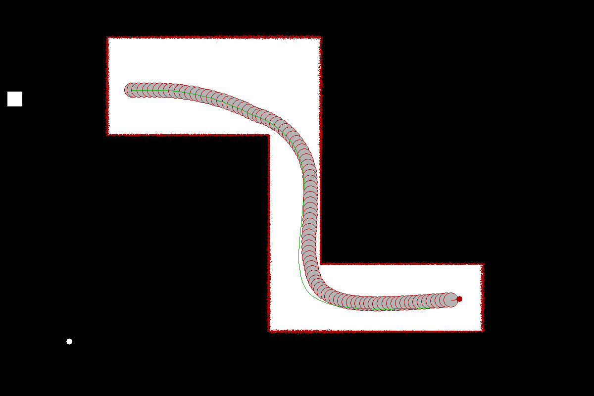
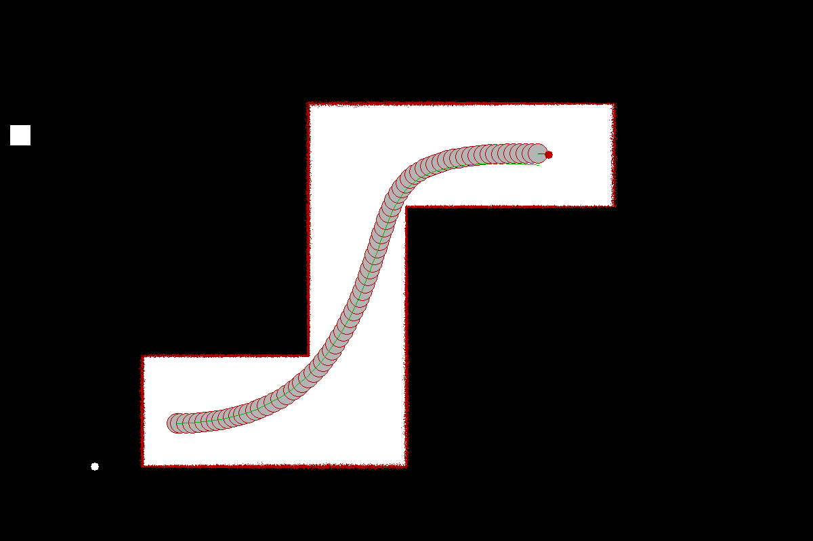
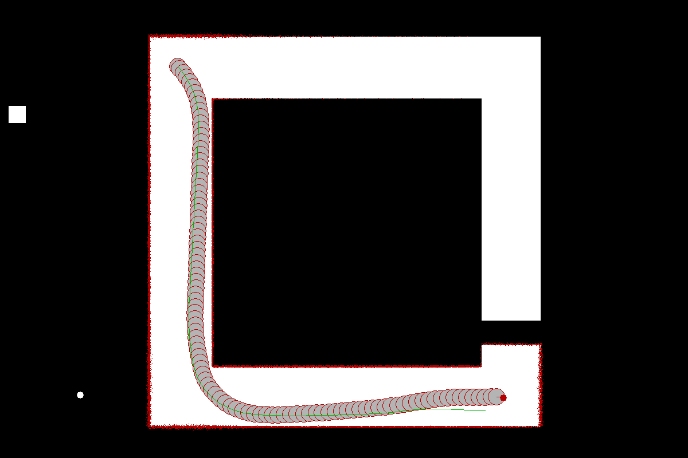
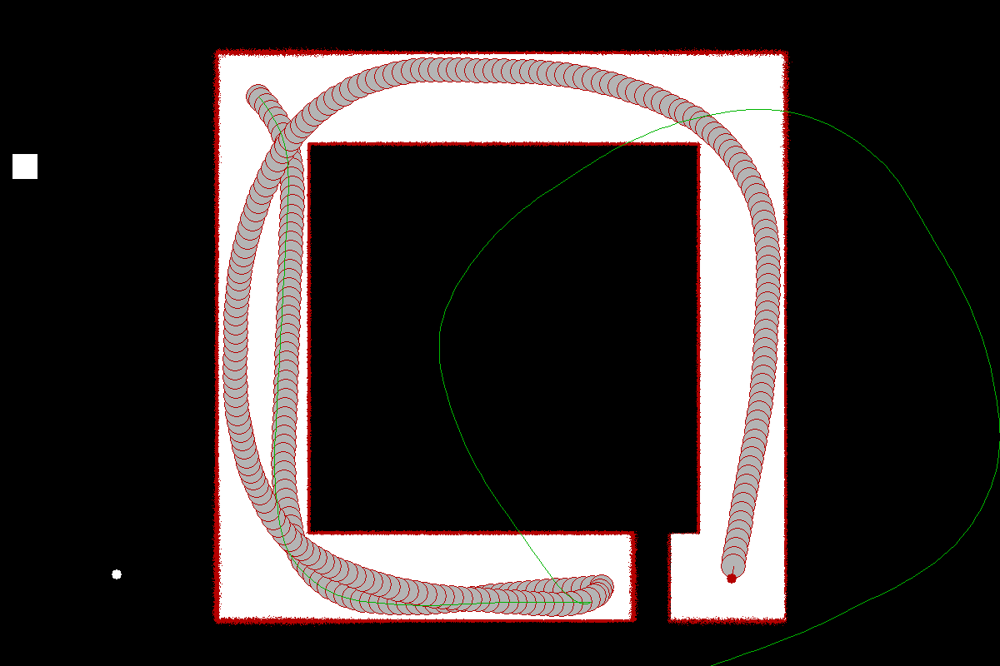

# planner

<div>
  <div>
    
    
  </div>
  <div>
    
    
  </div>
</div>

NJUST 机器人导航 Python 框架，实现了与 Plan_Server 通信、基础的 Planner 类和一些自动化操作。

将 Plan_Server 放置到 plan_server/ 文件夹下

使用 PDM 包管理器，配置环境并安装依赖后，执行 `pdm run main` 启动仿真。

文件结构如下：

``` text
src/
- plan_client/
    - c_structs.py        <- 定义一些 C 结构体，便于 Socket 通信序列化和反序列化，可以查看成员的具体含义
    - server.py           <- 定义 Server 类，封装了 Plan_Server 的启动和一些自动化操作
    - client.py           <- 定义 Client 类，封装了和 server 通信的循环函数，根据 server 返回的状态输出或自动退出循环
    - planner.py          <- 定义 Planner 基类，可以继承重写 plan() 和 locate() 
    - planners/           
        - cvm_planner.py  <- 基础的 CVM 实现，使用 numpy 向量化并行计算
- init_settings.py        <- 地图、目标点、机器人和动态障碍物的设置
- map_vis.py              <- 基于 Qt 的地图可视化，未进行优化
- main.py                 <- 主程序
```
